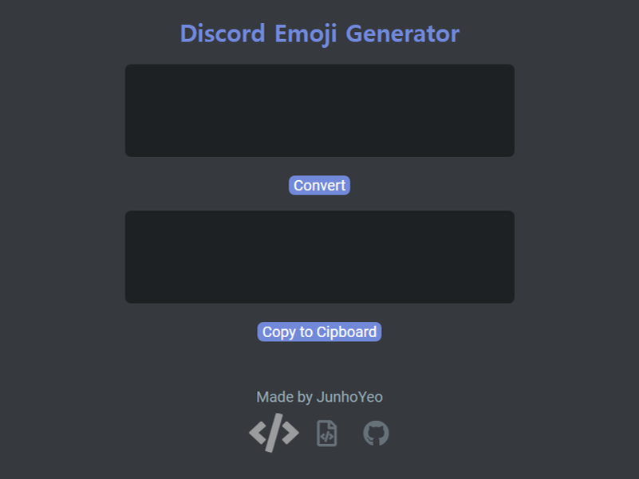

# Discord Emoji Generator
2018.02.17 ~ 2018.02.18<br>
<a href="http://emoji.dothome.co.kr">emoji.dothome.co.kr</a><br>
본 프로젝트에는 <a href="LICENSE">MIT 라이선스</a>가 적용됩니다.

## Discord Emoji?
<br>

디스코드(Discord)를 사용하다 보면 위와 같은 이모지(Emoji)라는 이모티콘으로 대화하는 유저분들을 만나기도 합니다. 이런 분들과 대화를 나눌 때면, 같이 이모지로 대화하고 싶어지기도 합니다. 그러나 새 이모지를 삽입하는 단계가 꽤 번거롭기 때문에, 빠르게 이모지로 대화하는 것이 어려울 때가 많습니다.<br>
그래서 이 프로젝트를 진행하게 되었습니다.

## Web Generator
<br>

이 프로젝트는 Python3을 이용해서 먼저 개발되었고 현재는 웹 페이지 버전 역시 만들었습니다.<br>
위 스크린샷과 같은 UI를 지니고 있으며, 위 textarea에 변환할 텍스트를 넣고 Convert 버튼을 누르면 아래 textarea에 이모지 형식으로 변환되어 나타납니다.<br>
Copy to Clipboard 버튼으로 변환된 텍스트를 클립보드로 복사할 수 있습니다.<br>
아래 아이콘을 클릭하면 각각 `페이지 소스 보기`, `Python3 버전 소스 보기`, `프로젝트 깃허브 페이지`로 연결됩니다.

#### How to use?
이 저장소를 다운로드하시고 `index.html`을 브라우저로 여시면 빠르게 웹 버전을 이용할 수 있습니다.<br>
현재 http://emoji.dothome.co.kr 에서 호스팅되고 있습니다.

## Python3 Version
Python3로 개발되었던 초기 버전은 <a href="https://github.com/JunhoYeo/Discord-Emoji-Generator/tree/master/Python3"><strong>`같은 저장소의 Python3 폴더`</strong></a>에서 확인할 수 있습니다.

#### How to use?
해당 버전의 프로그램은 Python3로 개발되었습니다. 프로그램을 실행할 환경이 Python3가 설치된 환경인지 확인한 다음, `emoji-maker.py`를 다운받은 위치로 이동해서 실행할 수 있습니다. 아래에서는 사용법에 대해서 기술하겠습니다.

##### 도움말 보기
Enter 키를 누르거나, `help`, `usage`를 입력하여 도움말(usage)을 확인할 수 있습니다.

##### 입력 모드
프로그램을 실행하고 전환할 문자열을 입력하면 알파벳과 숫자가 디스코드 이모지 형식으로 변환되어 화면에 출력됩니다. 해당 부분을 복사하시고 디스코드 메세지 입력란에 붙여넣어 전송하시면 메세지에 이모지가 나타납니다.

##### 파일 모드
`file`을 입력하고 안내에 따라 텍스트 파일의 주소를 입력하면(프로그램 위치 기준) 해당 파일 내용의 알파벳과 숫자가 디스코드 이모지 형식으로 변환되어 화면에 출력됩니다.<br>
공백의 경우 이모지와 섞일 경우 부분이 명확하지 않아 두 칸 공백으로 교체됩니다.<br>
디스코드 특성상 2,000자를 초과하는 메세지는 전송할 수 없으므로 이점 유의하시길 바랍니다.<br>
```
file
input text file name to generate discord emoji : test.txt
:regional_indicator_l: :zero: :regional_indicator_r: :regional_indicator_e: :regional_indicator_m:   :one: :regional_indicator_p: :regional_indicator_s: :regional_indicator_u: :regional_indicator_m:   :regional_indicator_d: :regional_indicator_o: :regional_indicator_l: :regional_indicator_o: :regional_indicator_r:   :regional_indicator_s: :regional_indicator_i: :regional_indicator_t:   :four: :regional_indicator_m: :three: :regional_indicator_t:

:regional_indicator_c: :regional_indicator_o: :regional_indicator_n: :regional_indicator_s: :regional_indicator_e: :regional_indicator_c: :regional_indicator_t: :three: :regional_indicator_t: :regional_indicator_u: :regional_indicator_r:   :regional_indicator_a: :regional_indicator_d: :regional_indicator_i: :regional_indicator_p: :regional_indicator_i: :regional_indicator_s: :regional_indicator_i: :regional_indicator_c: :regional_indicator_i: :regional_indicator_n: :regional_indicator_g:   :regional_indicator_e: :regional_indicator_l: :regional_indicator_i: :regional_indicator_t:   :regional_indicator_s: :regional_indicator_e: :regional_indicator_d:   :regional_indicator_d: :regional_indicator_o:   :regional_indicator_e: :one: :regional_indicator_u: :regional_indicator_s: :regional_indicator_m: :regional_indicator_o: :regional_indicator_d:   :regional_indicator_t: :regional_indicator_e: :regional_indicator_m: :regional_indicator_p: :regional_indicator_o: :regional_indicator_r:
```

위 예시의 실행결과를 디스코드 메세지에 삽입하면,

<br>

위 이미지와 같이 이모지가 정상적으로 생성되었음을 확인할 수 있습니다.
